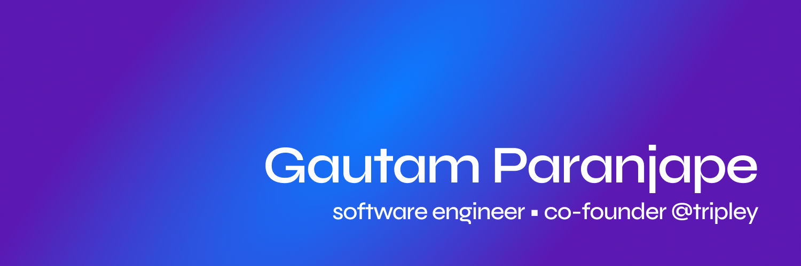

Hey there! I'm **Gautam**, a 14-year-old student, passionate about software engineering.

I've been building my skills for multiple years now, with experience in various projects, including open source and companies. My main focus is full-stack engineering, primarily through React.js, TypeScript, Express.js, and PostgreSQL. I also have experience in mobile development, systems programming, DevOps, and cloud technologies.

Currently, I’m working as a product engineer at [Foyer](https://foyer.work), helping maximize the performance of engineering teams.

I'm also building [Tripley](https://tripley.app/), a platform that enables travelers to plan and manage their trips.

If you're interested in chatting about anything software-related or just want to connect, feel free to reach out! You can reach me through:

* **Email** - [gautamparanjape8@gmail.com](mailto:gautamparanjape8@gmail.com)
* **Twitter** - [https://twitter.com/gautamparanjape](https://twitter.com/gautamparanjape)
